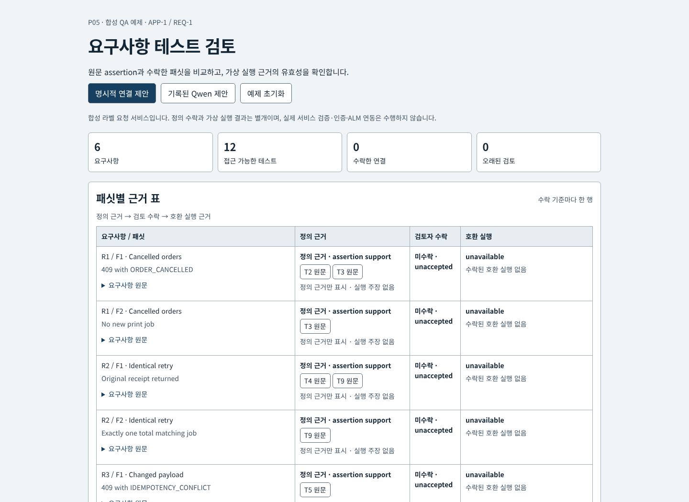
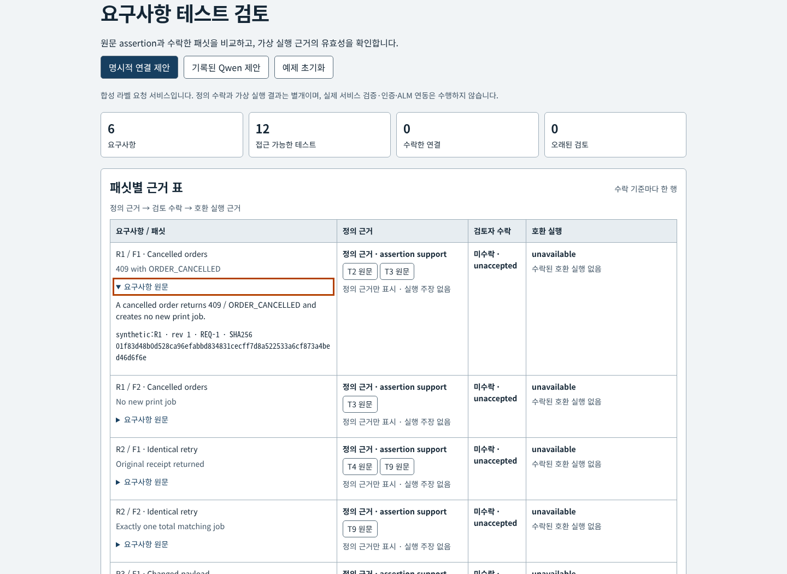
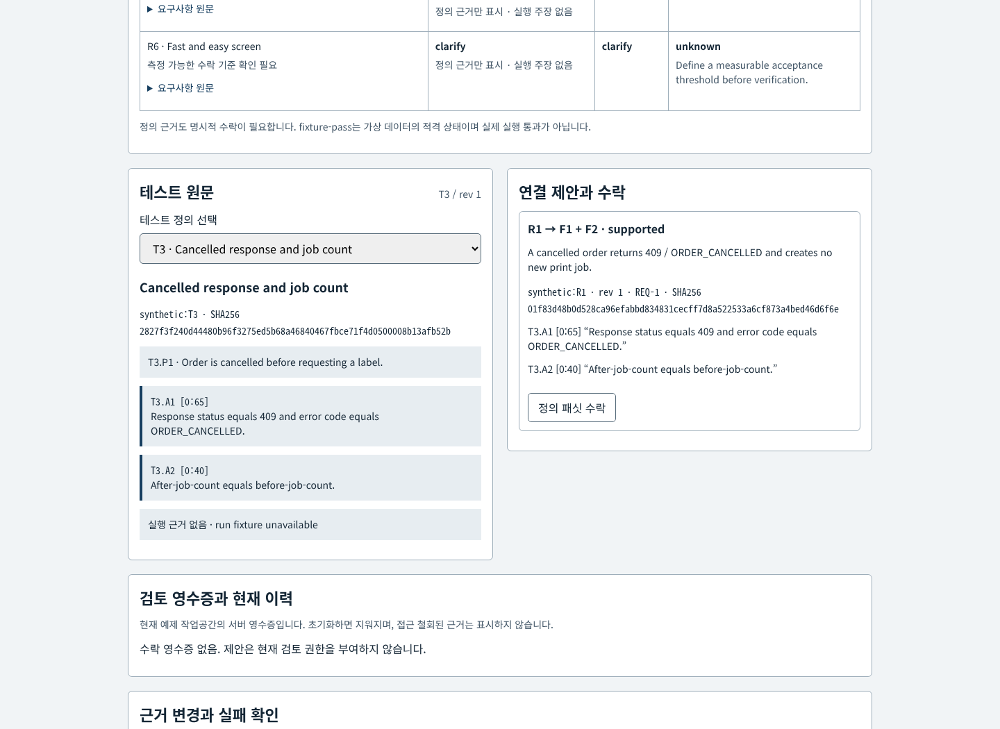
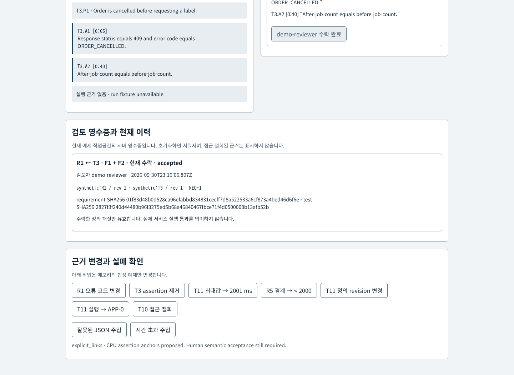
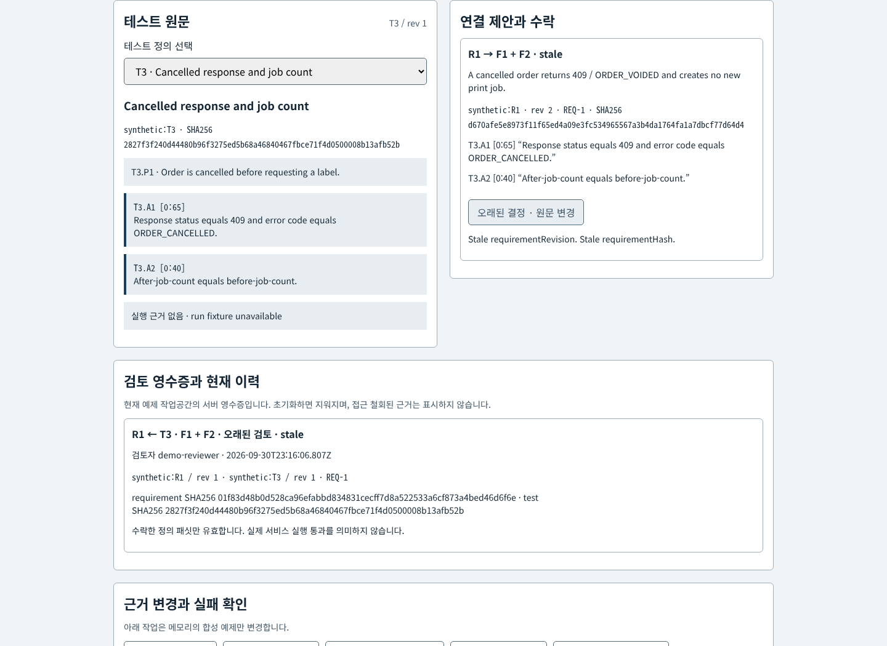
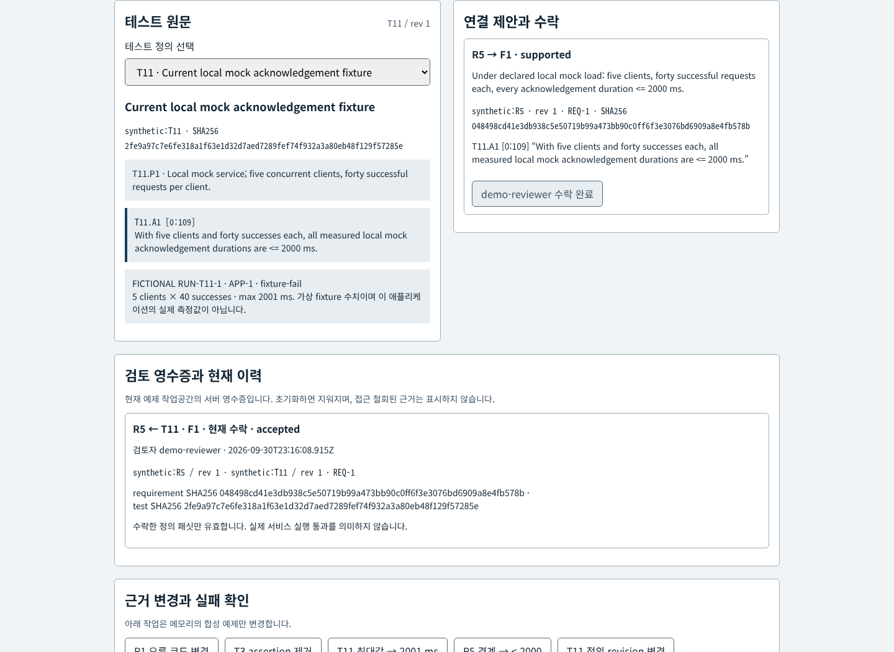
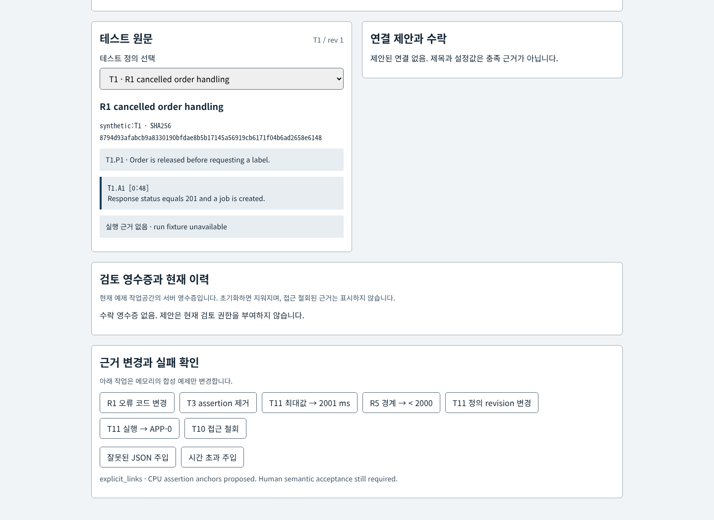
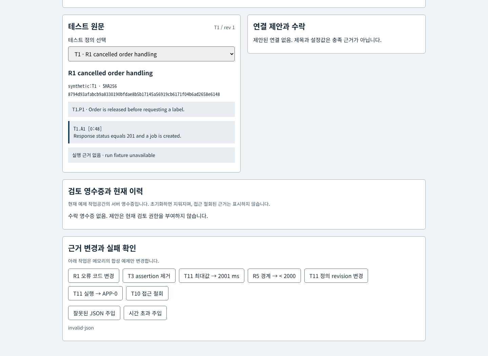
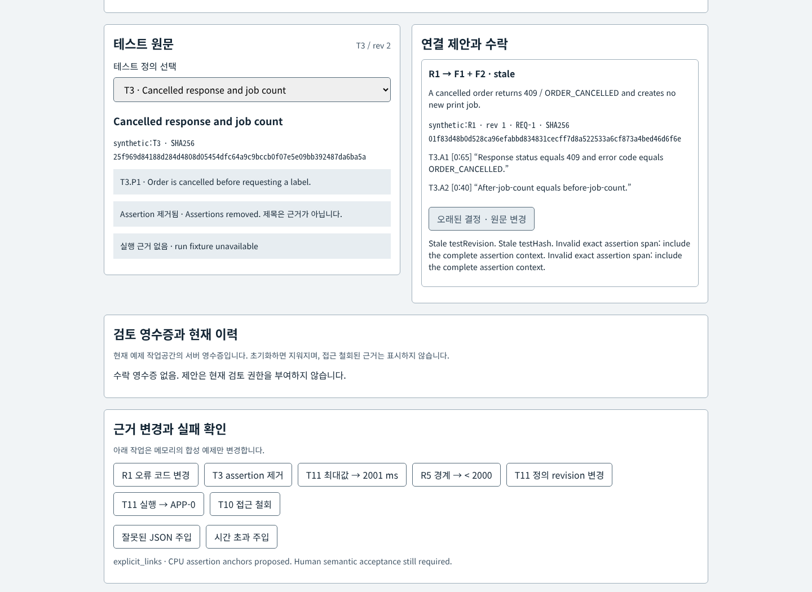
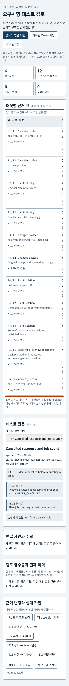

# 요구사항 테스트 검토 · P05

[구조 SVG](docs/architecture.svg) · [미디어 출처](docs/asset-provenance.md)

요구사항 원문과 테스트 assertion을 비교해 패싯 연결을 명시적으로 수락합니다. 정의·검토 수락·가상 실행은 각각 다른 근거입니다. 합성 서비스 예제이며 실제 서비스 테스트나 인증을 수행하지 않습니다.

현재 UI는 원문과 결과를 같은 폭의 흰색 패널로 보여줍니다. 패싯 표와 원문 링크, 정확한 구간·revision·SHA256, 실패·오래된 근거·접근 철회 상태를 유지합니다. 검토 영수증은 서버가 필터링한 현재 메모리 작업공간의 이력이며 영구 감사 기록이 아닙니다.



패싯별 정의·수락·실행 근거.



키보드로 연 원문과 테스트 근거.



수락 전 연결 제안.



반복 수락 후 하나의 검토 영수증.



원문 변경으로 오래된 수락.



가상 2001ms 경계 충돌.



접근 철회 후 T10 근거와 영수증 제거.



잘못된 JSON 주입과 제안 비우기.



Assertion 제거 후 수락 차단.



390px 제목과 키보드 스크롤 표.

[현재 UI 실제 조작 영상 MP4](artifacts/ui-refit/review-demo.mp4) · [WebM](artifacts/ui-refit/review-demo.webm) · [새 브라우저 검증](artifacts/ui-refit/browser-checks.json) · [동시성 검증](artifacts/ui-refit/client-race-fixed.json) · [해시·크기·동결 출처](artifacts/ui-refit/provenance.json)

영상은 자동화된 Chrome UI 조작을 기록합니다. 2000/2001ms는 가상 fixture 수치이며 서비스 성능 측정이 아닙니다. 이번 UI 갱신의 GPU·모델 호출은 **0**입니다. 기존 Qwen 평가 12회와 결과는 변경하지 않았습니다.

기존 [이미지와 영상](artifacts/media)은 이전 UI의 역사적 기록입니다. [기능 목록](feature-inventory.md)을 변경 전 작성했으며, 원래 30개 Node와 6개 Python 검증 및 실제 Chrome 키보드·stale 클릭·두 검토자·철회·반복 수락·390px 검증을 통과했습니다. Chrome 검증은 로컬 실행이며 CI는 CPU 검증입니다.

## Try the desk

```sh
npm test
npm start
# http://127.0.0.1:5055
```

Node 18+; no npm install or paid service is required. Choose **명시적 연결 제안**, inspect the requirement text, test precondition and full assertion spans, then accept a link. **기록된 Qwen 제안** loads actual archived model suggestions without calling a model. Review decisions are held in one in-memory demo workspace; reset restores the frozen original fixture. See the [runbook](docs/runbook.md) for optional evaluation, local browser recording and production limitations.

## Three different kinds of evidence

| Evidence | Contents | What it establishes |
| --- | --- | --- |
| Test definitions | Preconditions and assertions, immutable source IDs, revisions and SHA256 hashes | Eligible definition facets only after reviewer acceptance |
| Fictional run fixtures | Only T8 and T11 have fictional results and declared local mock measurements | Baseline/version/timing eligibility of fixture data, never actual measured service performance |
| Executed repository tests | Node engine/HTTP/evaluator regressions and Python mocked lease checks | Actual checks of this implementation's logic, not execution of T1–T12 against a manufacturing service |

The current software baseline is **APP-1**, the requirement baseline **REQ-1**. R1–R5 are approved revision 1. R6 is draft, with no measurable acceptance threshold; the result is **clarify**, not an invented SLO.

## Frozen original fixture

| Definition | Supported facets | Execution fixture |
| --- | --- | --- |
| T1 · title mentions R1, released order asserts 201/job created | None | Unavailable |
| T2 · cancelled order, 409 / ORDER_CANCELLED | R1 F1 · partial | Unavailable |
| T3 · cancelled error and unchanged job count | R1 F1 + F2 | Unavailable |
| T4 · identical retry, original receipt only | R2 F1 · partial | Unavailable |
| T5 · changed payload, conflict and original receipt/payload preserved | R3 F1 + F2 | Unavailable |
| T6 · plant-A list excludes plant-B | R4 F1 · partial | Unavailable |
| T7 · configured timeout equals 2000, no timing | None | Unavailable |
| T8 · five clients × forty successful requests, each acknowledgement ≤ 2000ms | R5 F1 | **Fictional APP-0 · stale** |
| T9 · identical retry receipt and exactly one matching total job | R2 F1 + F2 | Unavailable |
| T10 · known plant-B detail and source each 403/no restricted fields | R4 F2 + F3 · partial | Unavailable |
| T11 · correct R5 definition, declared current measurements | R5 F1 | **Fictional APP-1 · eligible fixture pass** |
| T12 · title/colour with “fast and easy” words | None; R6 needs clarification | Unavailable |

R1 requires 409/ORDER_CANCELLED **and** no new print job. R2 requires the original receipt **and** exactly one total matching job. R3 requires 409/IDEMPOTENCY_CONFLICT **and** preservation of the original receipt/payload. R4 requires list, detail and source/metadata isolation. T6 + T10 can jointly cover R4's definition, but absent runs remain unavailable. Unlisted pairs are unsupported, not automatically contradictory.

T11's numbers are **fictional**: concurrency 5, successes `[40,40,40,40,40]` (200 total), maximum acknowledgement 2000ms. Configuration values are never measurements. No performance measurement was collected by this project.

## Review and mutation behavior

Every proposed link binds the captured requirement/test source IDs and hashes, revisions, requirement baseline, facet IDs and exact complete assertion spans. For example, T3.A1 uses `[0:65]`, not a title match. The human accepts only the stated facets; a proposed or stale link contributes zero current authority.

| Change | Result |
| --- | --- |
| Revise R1's error code | Old accepted review becomes stale; old code assertion cannot cover new F1 |
| Remove T3 assertions, leave its title | Both facets disappear and prior review becomes stale |
| Change T11 maximum to 2001ms | Fails the ≤ 2000 boundary; accepted definition remains distinct |
| Change R5 to < 2000ms | 2000 fails the stricter boundary; weaker old definition/review also requires revision |
| Change test revision or run software baseline | Blocks current execution eligibility |
| Revoke T10 access | Removes its details, count hints, coverage and cached review authority |
| Invalid model JSON / bounded timeout | Explicit failure state; CPU review remains available |

The UI provides labeled injected JSON/timeout failures for recovery demonstrations. These are separate from the real model-attempt results.

## Actual bounded Qwen comparison

The original [gold](gold.json), fixture and protocol were committed **before prompting**. Gold SHA256: `b56742bb33f4be640fd2d28e4a9578bc25b96a708ac86b37068182526fdae2fa`. Runtime and model requests never read gold. **0 development/tuning calls; 12 evaluation attempts**, one per definition, all completed with parseable JSON. No failed attempt was removed or retried.

| Method · facet-link scoring against 13 original gold links | True positive | False positive | False negative |
| --- | ---: | ---: | ---: |
| Explicit-link rule baseline | 13 | 0 | 0 |
| Raw Qwen proposals | 13 | 9 | 0 |
| Qwen after source/semantic guards | 8 | 0 | 5 |

The raw model overclaimed partial tests (T2, T4, T6, T10), configuration-only T7, title-driven T1 and vague T12. Guards reject an entire mixed valid/unsupported proposal, which deliberately loses five otherwise valid partial facets. This result does **not** show Qwen outperforming the baseline. No model link was automatically or manually accepted as part of evaluation.

Model: existing local Ollama **qwen3:4b**, RTX 4060 8GB. Limits: 4096 context, 512 output tokens, temperature 0, seed 42, thinking disabled, 60s HTTP bound, concurrency 1. Observed client latency: 1.959–3.807s per call, mean 2.782s; total 33.383s. These are model-call timings, not R5 service acknowledgement measurements. No new weights or paid APIs were used.

[Evaluation report](artifacts/model-evaluation.json) · [Unmodified attempt records](artifacts/model-attempts) · [Prompt inputs](artifacts/model-input.json) · [Source snapshot](artifacts/source-snapshot.json)

The archived run snapshot was reconstructed from its pre-inference source commit and verified against **all 12 recorded request payloads** during independent-review fixes; it is labeled as reconstructed, not falsely claimed as a pre-created manifest. Future runs capture the manifest before inference. Re-scoring did not rerun or tune Qwen. Archived suggestions retain those old source versions and cannot be rebound to edited current definitions.

## Validation and review

**30 Node tests and 6 Python transport tests pass.** CPU checks cover the original mapping, partial/union semantics, exact spans, source substitution, revision staleness, unrelated run isolation, timing boundaries, access revocation, malformed archived outputs and replayed source versions. Python tests mock HTTP; they check shared busy/blocked behavior, durable timeout barriers, symlink rejection, retained flock after marker failure, and retention even when artifact writes fail. No GPU call occurs in CI.

An [independent GPT-6 Astra review](docs/review.md) found and drove fixes to source identity, unrelated run eligibility, archived source binding, malformed proposal handling and lease retention. The final review confirmed all reported blockers resolved. Historical pre-refit [browser evidence](artifacts/media) covers repeated acceptance, stale review, failed timing fixture, stale APP-0 execution, access revocation, removed assertions, recorded proposals, and injected failure states. Historical [published README checks](artifacts/published-checks.json) verified successful live GitHub image loading at 360px, 390px and 1440px (natural 420 × 700, displayed 294px, 324px and 420px respectively). Matrix columns remain scrollable on narrow screens.

## Enterprise context

[Source chronology and limits](docs/enterprise-context.md) distinguishes PTC's December 2024 development/beta plan, Microsoft's May 2025 Volkswagen story, Codebeamer 3.1's August 2025 private preview, and Codebeamer 3.2/AI 1.0's December 2025 release announcements. The 20–40% figure in Microsoft's story concerns general Codebeamer customer workflows, with no disclosed accuracy/population; it is not a measured Volkswagen AI result. This fixture is our own original material and uses no Volkswagen/private architecture or data.
